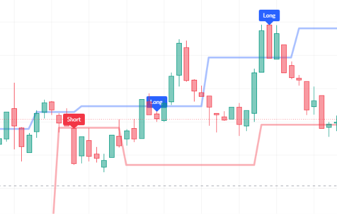

# Pine-Script-Linear-Based-HMA-Pivot-Indicator
Indicator based on smoothed Hull Moving Average (HMA 9) pivot structural high/low breakout detection (double top / double bottom necklines), 1-hour macro candle polarity, and 7-period RSI momentum confirmation. Signals high-confluence Long and Short breakout entries on TradingView.
--
## Chart Preview

--
## Motivation & Problem
- **Wick Noise & False Neckline Breakouts**: Identifying classical chart patterns (such as double tops and double bottoms) directly on raw candle highs and lows often produces false breakouts caused by erratic micro-wicks and low-volume spikes.
- **The Core Goal**: To detect clean structural pattern breakouts by applying pivot high/low detection directly onto a low-lag 9-period Hull Moving Average (HMA), requiring simultaneous confirmation from 1-hour macro candle polarity and 7-period RSI momentum before triggering an entry.
--
## Strategy Logic & Architecture
- This indicator eliminates wick noise and avoids counter-trend traps by utilizing a **rule-based, multi-factor filtering system**:
### Core Components:
1. **HMA Pivot High/Low Structural Detection ("쌍봉/쌍바닥")**:
  - Calculates a fast 9-period Hull Moving Average ('hullma') to smooth out erratic intra-bar noise while retaining responsive price curvature.
  - Computes structural swing pivots directly on the HMA curve using 3-bar left and right lookback windows ('ta.pivothigh(hullma, 3, 3)' and 'ta.pivotlow(hullma, 3, 3)').
  - Persistently tracks the most recent valid pivot levels:
    - **Resistance ('lastPivotHigh')**: Identifies the central peak of double-bottom formations or local swing ceilings.
    - **Support ('lastPivotLow')**: Identifies the central trough of double-top formations or local swing floors.
2. **Smoothed Curve Breakout Triggers**:
  - **Bullish Breakout ('hmaLong')**: Fires when the HMA curve crosses above the recent pivot resistance line ('ta.crossover(hullma, lastPivotHigh)').
  - **Bearish Breakdown ('hmaShort')**: Fires when the HMA curve crosses below the recent pivot support line ('ta.crossunder(hullma, lastPivotLow)').
3. **1-Hour Macro Candle Polarity & RSI Filter**:
  - **1-Hour Macro Direction**: Requests current 1-Hour candle open and close prices via 'request.security()', verifying the macro hourly bar is green ('CloseHour > OpenHour') for longs or red ('CloseHour < OpenHour') for shorts.
  - **RSI Momentum Confirmation**: Computes 7-period RSI, requiring values strictly above 52 for longs ('RSILong') or strictly below 42 for shorts ('RSIShort').
4. **Execution Rules**:
  - **Long Signal**: Triggers when HMA breaks above recent pivot high resistance ('hmaLong'), the 1-hour candle is bullish ('HourLong'), and 7-period RSI is above 52 ('RSILong'). Renders a blue "Long" label above the bar.
  - **Short Signal**: Triggers when HMA breaks below recent pivot low support ('hmaShort'), the 1-hour candle is bearish ('HourShort'), and 7-period RSI is below 42 ('RSIShort'). Renders a red "Short" label above the bar.
5. **Dynamic Support & Resistance Plotting**:
  - Plots 'lastPivotHigh' as a bold blue line ('style_linebr') representing active resistance.
  - Plots 'lastPivotLow' as a bold red line ('style_linebr') representing active support.
--
## Configurable Parameters
Users can adjust the following parameters inside TradingView's settings panel:
- **HMA Length**: Default - 9. Lookback period for the base Hull Moving Average.
- **Pivot Lookback Left ('p_leftLen')**: Default - 3. Left-side bar confirmation length for HMA pivot detection.
- **Pivot Lookback Right ('p_rightLen')**: Default - 3. Right-side bar confirmation length for HMA pivot detection.
- **RSI Settings**: Built-in length 7 with directional thresholds at 52 (Bullish) and 42 (Bearish).
- **Macro Anchor**: Evaluates 1-Hour ("60") session bar polarity.
--
## How to Install & Use in TradingView
1. Open any chart (e.g., `BTC/USDT`) on **[TradingView](https://www.tradingview.com/)**.
2. Open the **`Pine Editor`** console at the bottom of the page.
3. Open `Linear-Based.txt` (or your Pine Script file), copy the source code, and paste it into the editor.
4. Click **`Save`** and then click **`Add to Chart`**.
5. Adjust left/right pivot confirmation periods in the indicator settings if you wish to capture wider or tighter swing intervals.
--
## Key Learnings & Engineering Reflections
1. **Indicator-Derived Pivot Detection ('ta.pivothigh(hullma, 3, 3)')**
  - I learned that applying pivot point algorithms directly onto a moving average rather than raw price bars filters out intraday wick spikes, producing clean, mathematically objective double-top and double-bottom neckline levels.
2. **Persistent Pivot Level Memory ('var float lastPivotHigh = na')**
  - I learned how to store and update dynamic structural levels using 'var' variables, allowing the indicator to remember the most recent confirmed swing level until a new structural pivot is officially validated.
3. **Macro Hourly Bar Confluence with Micro Breakouts**
  - I learned that combining an immediate curve breakout with the current 1-hour candle polarity ('CloseHour > OpenHour') prevents taking breakouts against the dominant session flow, significantly boosting win rates on low-timeframe setups.
